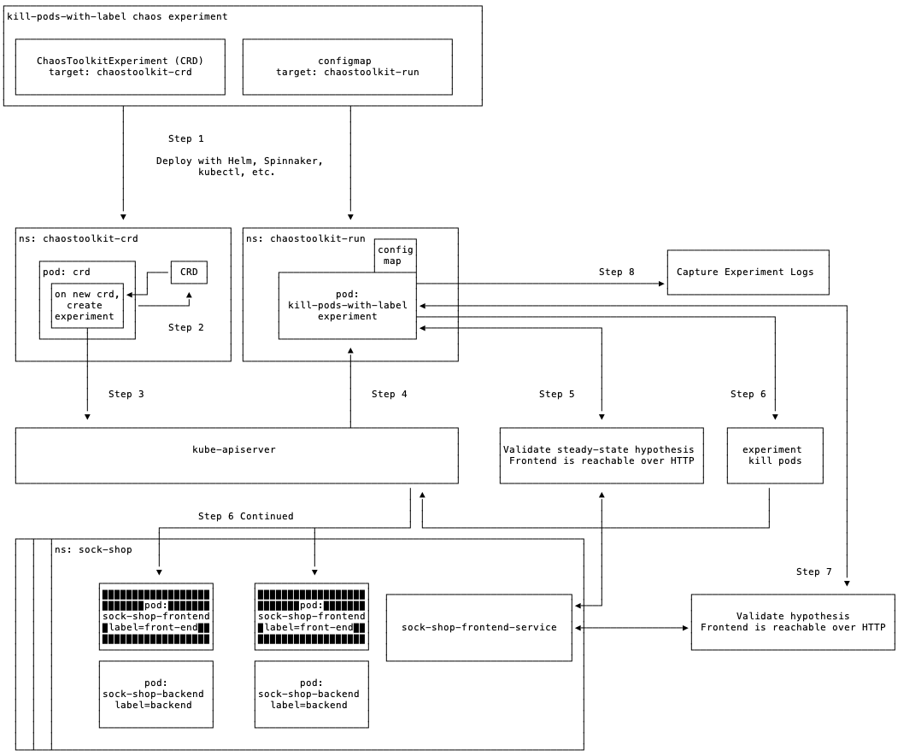

# Running an Experiment

* Step 1: Create experiment CRD + ConfigMap, deploy to cluster
* Step 2: crd pod watches for new resources
* Step 3: crd pod triggers the creation of an experiment pod in the run namespace when a new crd is added
* Step 4: experiment pod is created, with the experiment configmap mounted as a volume
* Step 5: experiment start - validate steady state hypothesis
* Step 6: experiment executes - perform chaos activity (in this case, killing pods)
* Step 7: experiment finish - validate hypothesis again
* Step 8: capture logging output with HTTP, webhook, or local file

